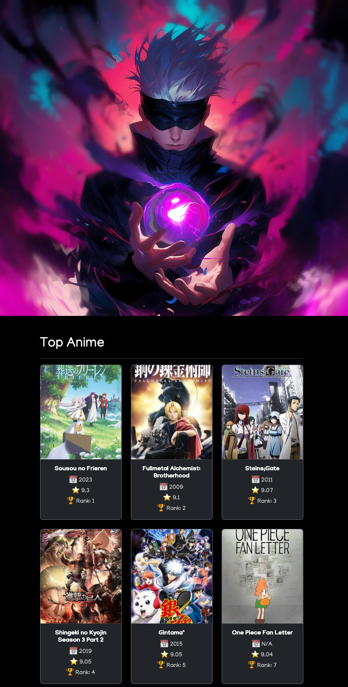
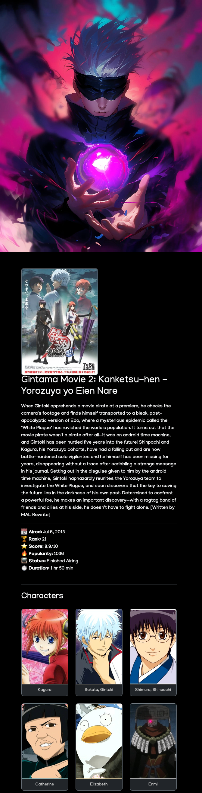

# 🎌 Anime-X

**Anime-X** is a dark-themed Laravel + Blade web application that uses the [Jikan API](https://jikan.moe/) to fetch and display anime data. Users can browse the top-rated anime, view detailed information including score, rank, airing dates, and character galleries — all styled in a modern, retro-inspired dark UI using Bootstrap.

---

<p align="center">
    <video autoplay loop><source src="screenshots/wallpaper.mp4" type="video/mp4"></video>
</p>

<p align="center">
    
    
</p>

---

## ✨ Features

### 🔍 Top Anime Browser
- View a curated list of top anime directly from the Jikan API.
- Responsive grid layout with poster images, titles, ranks, and scores.

### 📄 Anime Detail Page
- Full-page view with:
  - Title and synopsis
  - Year, airing dates, status
  - Rank, score, popularity
  - Duration per episode
- Character gallery with images and names

### 🖤 Dark Theme & UI
- Clean, minimalist dark UI built with Bootstrap 5
- Retro-style video background
- Custom card animations and hover effects
- Font: `Manjari` for unique styling

---

## ⚙️ Tech Stack
- **PHP 8+**
- **Laravel**
- **Blade Templates**
- **Bootstrap 5**
- **Jikan REST API**
- **Custom CSS (Dark Theme)**

---

## 📦 Installation & Local Setup

Follow these steps to install and run Anime-X locally:

```bash
# Clone the repository
git clone https://github.com/Alorythm/anime-x.git
cd anime-x

# Install PHP dependencies
composer install

# Install JS dependencies
npm install

# Configure environment
cp .env.example .env
php artisan key:generate

# (Optional) Set up database if needed
# DB_DATABASE=anime_x
# DB_USERNAME=your_db_user
# DB_PASSWORD=your_db_pass

# Run database migrations (if applicable)
php artisan migrate

# Start local development server
php artisan serve

# In a separate terminal, compile assets
npm run dev